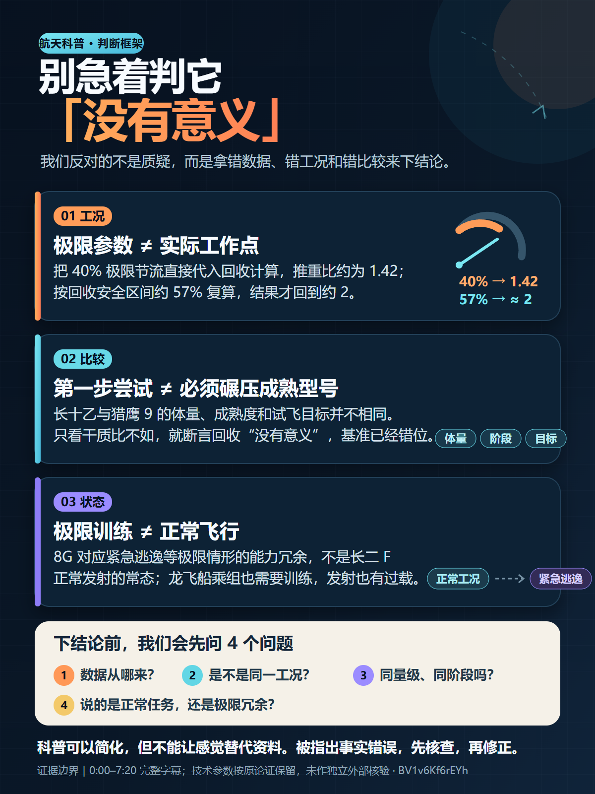

# BV1v6Kf6rEYh 实测：按载体重构为作者口吻一图流

测试日期：2026-08-02（Asia/Shanghai）

视频：[【第三集】长十乙回收无意义？中华超人抗 8G 过载？吐槽离谱航天视频](https://www.bilibili.com/video/BV1v6Kf6rEYh/)，
时长 7 分 21 秒，发布者为“尾焰已扩散”，片中由“尾焰已扩散”和“助推上天”联合讲述。

## 测试目的

1. 验证平台字幕、双尺度硬字幕 OCR 和 ASR 能否完整保留为独立证据；
2. 验证硬字幕是否能在 ASR 失真的科普技术段承担主要证据；
3. 验证成品能否按一图流的阅读方式重建结构，而不是对齐视频段落；
4. 验证单人或联合作者内容能否使用作者直接口吻，而不是“这个视频认为”的摘要腔；
5. 验证 SVG、PNG、忠实度审计和最终交付门能否闭环。

## 字幕证据

最终 job 为 `sub_20260802T122612_6ca3255c33`，状态 `completed`，无 pipeline warning：

| 来源 | cue | 用途 |
| --- | ---: | --- |
| Bilibili 平台字幕 | 216 | 连续语音语义和时间轴 |
| VideOCR 双尺度共识稿 | 347 | 画面硬字幕、数字、专名和嵌入片段 |
| Qwen3-ASR + Forced Aligner | 86 | 独立音频佐证与冲突暴露 |

OCR 使用 1280px 主识别和 600px 验证识别。共识稿覆盖 91.01% 的验证时长，平均最佳
相似度为 0.9093。ASR 使用技术词上下文并识别为中文，但在 05:41–06:59 的 8G 技术段
把大量语音折叠成一个失真 cue，不能用于校正文意。该范围最终以平台字幕和双尺度 OCR
互证；ASR 作为冲突证据保留，没有覆盖 OCR。

`review-prepare` 生成 15 个审阅窗口，其中 13 个为高优先级。这说明“有 ASR”并不等于
每个段落都能三路一致；对嵌入片段、画面文字和技术名词密集的视频，硬字幕仍是核心。

## 调度结果

最终任务选择 `media_execution=serial`，完整用时 381 秒：

- 双尺度 OCR backend：约 139 秒；
- ASR backend：约 221 秒，其中模型推理约 207 秒；
- ASR 峰值显存：约 10408 MiB。

同一视频的显式并行尝试中，OCR 与 ASR 争抢同一块 GPU，ASR 第一段曾用时 470 秒；
串行时同一段为 35 秒。显存放得下不代表并发更快。`auto` 在共享 GPU 时选择串行是正确
默认；只有与实际 OCR 分辨率、双尺度设置和视频形态相近的样本证明有效时，才应显式并行。

## Content map 不是时间轴

项目 ID 为 `content_c99d1fffc252ec5b`。`cmap-001` 完整覆盖 00:00–07:21，包含：

| 对象 | 数量 |
| --- | ---: |
| 带时间戳证据引用 | 17 |
| claim | 7 |
| caveat | 3 |
| counterpoint | 1 |
| term | 2 |
| visual ref | 3 |
| uncertainty | 2 |
| Agent inference | 1 |
| 概念章节 | 5 |

时间戳只负责回到证据。概念章节先给“下结论前校准判断框架”，再分别组织工况边界、
比较基准、正常/极限状态和科普责任，并不复制原片“逐段播放被批评内容—逐段吐槽—片尾
总结”的顺序。

## 一图流的信息结构与口吻

用户指定 `one_page`，内容也确实能由一个并列判断框架承载，因此没有改成文章。媒介计划
明确使用 `reconstructed_for_medium`：

```text
作者立场
├─ 工况：极限参数 ≠ 实际工作点
├─ 比较：第一步尝试 ≠ 必须碾压成熟型号
├─ 状态：极限训练 ≠ 正常飞行
└─ 下结论前的 4 个检查问题
```

`narrative_voice.mode=source_author` 同时绑定两位讲述者，成品使用“我们反对的不是质疑”
“下结论前，我们会先问”等联合作者口吻。正文没有“这个视频认为”“作者表示”或
“视频里提到”。说话人归属仍保留在 content map，作者口吻只改变人类可见的表达方式，
不抹掉证据元数据。



可直接检查或复用：

- [`SVG 源文件`](BV1v6Kf6rEYh-one-page.svg)，1200×1600；
- [`PNG 导出`](BV1v6Kf6rEYh-one-page.png)，1200×1600。

## 成品与审计

- content map：`cmap-001`，SHA-256
  `d10d89211d0839457ebfced9f486e5e76051df14503dc5f3990e19147b9454fc`；
- media plan：`mplan-001`，SHA-256
  `4ba79d6412c7c6543135297636c06819b185a8617affbf67c9f7c45f4d7b477f`；
- SVG：`dlv-001`，SHA-256
  `560beebefbd833de820d5f404aca3f2a1b6c2222677b55aa3eda501240a9b06c`；
- PNG 导出：SHA-256
  `b7f7e5221e1d39daa006197bbbadb18e0b58ee5933dca2d9cb18175c424f4a2c`；
- fidelity audit：`audit-001`，SHA-256
  `4345ef67995bee28790cb7f6ee285d1e47e234d542c246c65cdf476bf5431cf7`；
- 审计状态：`pass_with_warnings`；
- 最终校验：`valid=true`、`ready_for_delivery=true`。

两项警告都已在审计和交付中披露：

1. 火箭节流、质量、推重比和过载参数完成的是多源字幕互证，不是外部事实核验；
2. 8G 技术段的 ASR 失真，该段依赖平台字幕与双尺度 OCR。

SVG 页脚可见地写明“技术参数按原论证保留，未作独立外部核验”。如果要把这张图升级为
事实核验型科普材料，应再逐项对照论文、厂商或任务资料，而不是让成品审计冒充事实核验。

## 结论

本案例补上了第一版文章案例尚未验证的路径：

```text
平台字幕 + 双尺度硬字幕 OCR + ASR
-> 全片语义地图
-> 为一图流重建信息结构
-> 联合作者直接口吻
-> SVG / PNG
-> 逐项忠实度审计
-> 可交付校验
```

一图流不是视频缩略时间轴。证据需要时间戳，成品需要载体自己的信息结构；作者口吻也不
等于丢失归因，因为说话人与 claim 的关系仍在内容工程层完整保存。
