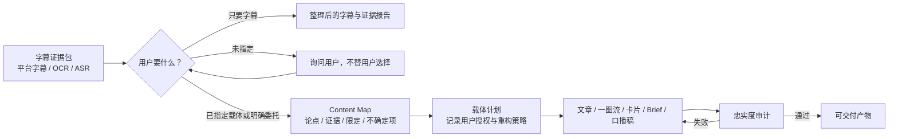

# 从视频证据到其他内容媒介

## 目标

字幕提取不是终点。内容工程层把已经核验的视频字幕证据转换为适合传播和阅读的载体，
同时保留“这句话来自哪里、哪些内容被省略、哪些结论仍不确定”。默认目标是降低信息接收
门槛，不是制造流量或营销文案。

项目只负责把输入转换为忠实、得体、恰当、优雅且通过审计的可交付成品。平台登录、上传、
草稿箱写入、定时发布、正式发布和账号管理属于另一条工作流，不在本项目范围内。



## Agent 与工具的边界

| 层 | 负责 | 不负责 |
| --- | --- | --- |
| 工具 | 固定证据哈希、保存版本、校验 ID/引用、检测过期产物、持久化成品 | 理解观点、判断语义、替用户决定载体、写作、设计 |
| Agent | 分段读取证据、重建语义、分析和推荐载体、按用户授权决定取舍、生成成品、逐句审计 | 修改原始证据、把自我推断伪装成原作者观点、未经授权替用户选择载体 |
| Skill | 决策步骤、Prompt、证据边界、载体决策门与审计规范 | 强制所有视频走同一模板、以传播效果覆盖准确性、登录或操作发布平台 |

这一区分是刻意的。可重复、可验证的工作交给工具；依赖上下文和判断的工作保留给 Agent。

## 四类核心产物

### Content project

`initialize_video_content` 在字幕 job 内创建项目，并记录：

- 字幕 manifest 的 SHA-256；
- 每份可读字幕证据的 ID、路径、类型与 SHA-256；
- 目标、受众和输出语言；
- 所有派生产物的版本与当前指针。

原始字幕不会被复制、改写或覆盖。源 manifest 或任何证据变化后，旧项目会变为无效，应从
新证据重新创建项目。

### Content map

Content map 是与载体无关的标准内容模型，主要包含：

- 实际分析范围和未覆盖范围；
- 带字幕来源和时间戳的证据引用；
- 归属到说话人、发布者或 Agent 综合判断的论点；
- 限定条件、反方观点、术语、画面信息和不确定项；
- 内容的论证或解释结构。章节按语义关系组织，可以合并、拆分或重排视频中的段落；时间戳
  只用于回溯证据，不规定成品顺序。

“视频中说了什么”和“这个说法在现实中是否正确”是两个字段层级。没有外部核验时，
`external_verification` 必须保持 `not_checked`。

### Media plan

Agent 不根据平台热度推荐载体，而根据四项内容结构判断：

- 论证深度；
- 上下文依赖；
- 视觉表达潜力；
- 不确定性水平。

用户已明确载体或明确委托 Agent 代选后，才创建媒介计划。计划只记录一个主要载体，并
明确必须保留的论点、限定条件、主动省略的内容及原因；同时记录用户授权、如何为该载体
重建信息结构，以及最终采用谁的叙述口吻。用户尚未决定时，项目停在 `mapped` 状态，
Agent 可以给出建议及其取舍，但不能创建媒介计划或成品。
一图流不是默认结果：当论证依赖多层上下文或限定条件无法清晰放入单页时，应选择文章。

单人作者口播默认使用作者直接口吻，不加“这个视频认为”“作者表示”一类外部转述框架；
访谈或多人讨论则保留不同说话人的身份。成品可以为了文章、单页或卡片的阅读方式调整
顺序，审计关注语义、归因、因果和限定是否改变，而不是要求与视频段落一一对齐。

### Fidelity audit

忠实度审计逐项检查成品中的实质性表述，确认它们对应哪些 claim，并检查媒介计划要求的
论点和限定条件是否在人类可见的成品中出现。

`pass_with_warnings` 只能表示不改变语义的非阻断限制。无依据的结论、语义强化、遗漏关键
限定、隐藏不确定性、错误归因、叙述口吻违约或翻译错误必须标记为 `fail`。失败后保存新的成品版本并重新
审计，不能覆盖旧版本。

## 状态和版本失效

```text
initialized
  -> mapped
  -> planned
  -> drafted
  -> complete | needs_revision
```

- 新 content map 会让当前媒介计划、成品和审计失效；
- `mapped` 是合法的决策门状态：下一步为 `RESOLVE_MEDIUM_DECISION`；若用户此前没有指定
  载体或明确委托 Agent 选择，此时必须等待用户决定；
- 新媒介计划会让当前成品和审计失效；
- 新成品会让当前审计失效；
- 每次保存产生 `cmap-001`、`mplan-001`、`dlv-001`、`audit-001` 一类独立版本。

## Prompt 组成

`video-to-content` Skill 只在相应阶段加载四个 Prompt：

1. `build-content-map.md`：从分段证据重建内容模型；
2. `select-medium.md`：分析适合的载体，并在用户决定或明确委托后记录一种载体；
3. `create-deliverable.md`：按计划生成成品并声明引用的 claim/caveat；
4. `audit-fidelity.md`：以独立审阅视角逐句核验。

Prompt 只规定问题、边界和交付契约，不提供固定摘要算法。

## 公众号文章交付协议

公众号文章不是“套一个公众号模板”。它仍然先完成内容重建，再把稳定稿交给可选的排版
Skill：

```text
Content map + Media plan
-> article.md（文章语义稿）
-> 可选公众号排版 Skill（只负责主题与 HTML）
-> 干净正文 HTML + 浏览器预览
-> 本地图片 + 可见插槽 + 导入清单
-> HTML 合规校验 + 忠实度审计
-> 可交付包
```

完整 Agent 契约见
[`references/wechat-article.md`](../.agents/skills/video-to-content/references/wechat-article.md)。
其中有四个不能互相替代的边界：

1. **文章先于排版**：Agent 可以为了阅读合并、拆分和重排论证，但必须先稳定
   `article.md`；主题组件不能反过来决定文章观点。
2. **正文与来源说明分层**：单人内容的正文默认采用作者直接口吻。原封面、UP 主、原标题、
   原始链接、转换方式和未核验边界位于正文前的独立来源说明中，不等于在正文里添加
   “这个视频认为”的外部总结者。
3. **本地图片是人工交接点**：不把相对路径、`file:`、`data:` 或 `blob:` 图片伪装成
   可复制图片。正文保留写明文件名的可见插槽，图片与导入清单随包交付。
4. **两层验证分别通过**：排版器的确定性检查只证明 HTML 能粘贴；本项目的 fidelity
   audit 才检查观点、归因、语气、限定和不确定性。

建议交付目录如下，文件名可以本地化，但角色不能含糊：

```text
wechat-article/
├─ article.md                    可继续编辑的文章语义稿
├─ article.html                  干净、可复制的正文片段
├─ article-preview.html          带复制按钮的本地预览外壳
├─ cover.jpg                     原视频封面或其他本地素材
└─ image-import-checklist.md     按文章顺序列出插入位置
```

若预览页有复制按钮，按钮和成功提示必须明确说明“只复制排版正文，本地图片仍需手动导入”。
浏览器预览外壳、复制脚本和图片二进制文件都不是 `save_video_content_deliverable` 保存的
正文；应保存并审计干净的人类可见 HTML。

[`isjiamu/gzh-design-skill`](https://github.com/isjiamu/gzh-design-skill) 已完成一次真实可选
集成，可负责主题组件、微信公众号兼容标记、HTML 校验和预览包装，但不是本项目依赖。
使用它时仍要服从媒介计划和用户偏好：主题自带的作者签名、二维码、关注提示或“点赞、
在看、转发” CTA 不能自动进入非营销型改编。在 Windows PowerShell 运行其带 Unicode
输出的脚本前，应设置 `$env:PYTHONIOENCODING="utf-8"`。Agent 可先用固定版本安装器执行
`npx -y skills@1.5.22 add isjiamu/gzh-design-skill --list` 做只读发现；安装范围由调用方策略
决定，不把第三方 Skill 复制进本仓库，也不写入核心 Python requirements。

本地图片尚未人工导入、但插槽、文件和清单完整且已披露时，可以作为
`pass_with_warnings` 的非阻断限制。缺少要求的来源说明、隐藏本地图片依赖、正文叙述口吻
错误或宣称不完整产物“可直接粘贴”则必须失败并返修。

## CLI 示例

```powershell
$init = video-subtitle content-init `
  --manifest .\result\manifest.json `
  --objective faithful_information_transfer `
  --audience "没有时间观看完整视频的读者" `
  --output-language zh-CN | ConvertFrom-Json

$project = $init.project_path

video-subtitle content-save --project $project `
  --kind content_map --document .\content-map.json
video-subtitle content-save --project $project `
  --kind media_plan --document .\media-plan.json
video-subtitle content-deliverable --project $project `
  --medium article --format markdown --content-file .\article.md `
  --title "文章标题" `
  --used-claim-id claim-0001 `
  --used-caveat-id caveat-0001
video-subtitle content-save --project $project `
  --kind fidelity_audit --document .\fidelity-audit.json
video-subtitle content-validate --project $project
```

## 对 dbskill 的复用边界

[`dontbesilent2025/dbskill`](https://github.com/dontbesilent2025/dbskill) 的内容资产工程、
动态路由和成稿检查思路对本层设计有参考价值，尤其是“原始材料不变、以语义单元组织、
先建立结构再扩展”。本项目没有把 dbskill 作为依赖，也没有复制其 Prompt：

- dbskill 的输入通常已经是文本或内容资产，不负责视频字幕证据；
- 本项目需要更细的 claim—evidence—timestamp 追溯；
- 部分传播方法偏向产品、情绪和立场，不适合作为忠实信息转换的上游原则；
- dbskill README 声明 `CC BY-NC 4.0`，本项目保持独立实现，避免把非商业许可内容混入
  MIT 代码与 Prompt。

未来可以把用户已安装的 dbskill 作为可选下游检查器，但它不会成为核心运行依赖。

## 当前限制

- 内容工程入口目前只接受本项目完成的字幕 manifest；
- 一图流的 SVG/HTML、文章 Markdown 等内容由 Agent 或独立渲染 Skill 生成，本项目只保存
  和校验，不内置模板化设计器；
- 本项目不提供发布平台登录、上传、草稿箱写入、定时发布、正式发布或账号管理；
- 当前 content map 的视觉引用由 Agent 从视频上下文判断，尚无按范围抽帧工具；
- 外部事实核验不自动执行；
- Bilibili 是当前唯一实现的平台适配器，YouTube 和抖音仍待接入。
