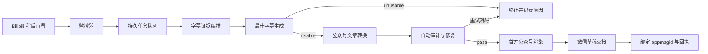

# Bilibili 稍后再看到微信公众号草稿自动化设计

- 日期：2026-08-16
- 状态：方向已确认，待实施
- 目标版本：0.7.x 起分阶段交付

## 1. 背景

项目当前已经具备 Bilibili 视频检查、平台字幕获取、硬字幕 OCR、音频 ASR、证据读取、字幕派生审阅、内容转换、忠实度审计、公众号文章包渲染和微信草稿回执等原子能力。

但现有使用方式仍然偏向“Agent 操作一个工具箱”：每个视频都需要显式选择能力、初始化内容项目、创建媒介计划、生成成品并单独授权草稿交接。目标用户真正需要的是一条无人值守的固定生产线：

> 把视频加入 Bilibili 稍后再看，系统自动生成经过多重校验的最佳字幕，并将对应文章保存到微信公众号草稿箱。

用户不负责处理字幕证据不足、文章审计失败等客观问题。系统能可靠处理就继续，不能可靠处理就终止并记录原因。只有浏览器登录失效等真实的人类边界才允许暂停自动化并请求恢复外部状态。

## 2. 目标

### 2.1 用户体验

正常流程中，用户只执行一个动作：

```text
把视频加入 Bilibili 稍后再看
```

随后系统自动完成：

```text
发现新增视频
→ 去重并排队
→ 获取独立字幕证据
→ 生成最佳字幕
→ 生成公众号文章
→ 自动审计和修复
→ 渲染公众号文章包
→ 保存微信公众号草稿
→ 验证保存结果
```

### 2.2 系统目标

1. 将“稍后再看”作为有意提交任务的入口，而不是普通收藏数据源。
2. 为每个视频生成一份可继续消费、可追溯的最佳字幕。
3. 固定输出载体为微信公众号文章，不再逐视频询问载体。
4. 正常任务全自动完成；暂时性错误自动重试；证据或内容根本不足时关闭失败。
5. 同一个视频和同一个自动化配置不得产生重复内容项目或重复微信草稿。
6. 自动化只能保存草稿，永远不发布、群发、定时、声明原创或管理账号。

## 3. 非目标

本阶段不负责：

- 自动发布或定时发布微信公众号文章；
- 自动群发、原创声明、赞赏、变现或账号管理；
- 自动删除或修改 Bilibili 稍后再看列表；
- 在字幕证据不足时通过猜测补全内容；
- 要求用户人工解决语义冲突或低质量媒体；
- 同时支持 YouTube、抖音等新平台；
- 把多条视频合并成一篇文章；
- 建设通用分布式任务平台。

## 4. 方案比较

### 方案 A：无条件全自动

每个新增视频都生成文章并保存草稿，不设质量门。

优点：实现和理解最简单。

缺点：字幕不足或文章失真时仍会污染草稿箱，不符合项目的证据边界。

### 方案 B：每篇文章人工确认

自动生成最佳字幕和文章，保存草稿前等待用户确认。

优点：平台副作用最保守。

缺点：用户仍需逐条管理，不能实现“加入稍后再看后不用再管”。

### 方案 C：有界授权、质量门和失败关闭的全自动流程

自动处理每个新增视频。只有最佳字幕可用、文章审计通过、公众号包校验通过时才保存草稿。暂时性错误自动重试；根本性不足终止任务；登录失效暂停相关阶段。

优点：同时满足无人值守、证据可靠和平台安全。

缺点：需要新增自动化状态机、任务队列、最佳字幕契约和长期授权契约。

**选择方案 C。**

## 5. 核心原则

### 5.1 复杂度留在系统内部

用户不需要了解平台字幕、OCR、ASR、Content Map、Media Plan、Fidelity Audit、图片清单或微信回执。系统仍可保留这些产物，但它们是内部可观察性和审计机制，不是用户步骤。

### 5.2 证据独立，结论派生

平台字幕、硬字幕 OCR、音频 ASR 和后续修订继续作为独立且不可变的原始证据。最佳字幕是新的派生产物，不能覆盖任何原始证据。

### 5.3 Agent 判断语义，工具验证状态

Agent 负责：

- 判断需要哪些证据；
- 判断当前证据是否足够；
- 解决字幕冲突；
- 生成最佳字幕；
- 提取内容结构；
- 写作、修复和审计文章。

工具负责：

- 监控、去重、排队和重试；
- 文件、哈希、来源和状态转换；
- 授权范围和平台副作用；
- 包校验和草稿保存回执；
- 防止重复处理和重复草稿。

### 5.4 失败关闭

无法可靠形成最佳字幕时，不生成文章。文章经过自动修复仍无法通过审计时，不保存草稿。系统不得把物理上无法恢复的信息转交用户判断，也不得以猜测填补缺口。

### 5.5 添加即提交

监控器首次发现某个稍后再看条目时，该条目即成为独立任务。之后用户从稍后再看移除该视频，不自动取消已经提交的任务，也不修改 Bilibili 列表。

## 6. 目标架构



### 6.1 自动化控制面

新增自动化控制面，负责：

- 读取自动化配置；
- 定期抓取稍后再看快照；
- 计算新增条目；
- 初始化幂等任务；
- 调度各阶段；
- 处理重试、暂停和终止；
- 汇总用户可见状态。

控制面不执行字幕语义判断和文章写作，只负责阶段编排。

### 6.2 现有字幕采集面

现有 `ExtractionPipeline` 保持“采集独立证据”的职责，不直接生成最佳字幕。自动化控制面根据 Agent 的证据计划调用平台字幕、硬字幕侦察、全片 OCR 和 ASR。

### 6.3 最佳字幕层

在证据层和内容层之间新增最佳字幕层。它读取一个完成的字幕 manifest 和 Agent 的派生决策，输出：

- `subtitle.canonical.srt`：后续内容生成使用的标准时间轴；
- `subtitle.canonical.json`：逐条字幕及来源引用；
- `subtitle.canonical.report.json`：可用性、来源、修订、未解决问题和停止原因。

工具只验证引用、时间范围、原文一致性和产物哈希。字幕文字选择和冲突解决由 Agent 完成。

### 6.4 内容转换层

内容项目改为消费“已完成字幕 manifest + 可用最佳字幕”。

对于固定的公众号自动化：

- Content Map 降级为内部轻量语义记录；
- Media Plan 由自动化配置替代，不再逐视频创建；
- Fidelity Audit 保留为自动质量门；
- 审计失败后允许 Agent 在有限次数内重写和重新审计；
- 重试耗尽后任务终止，不保存草稿。

### 6.5 平台交接层

微信草稿交接继续复用现有文章包、浏览器可见状态和无秘密回执机制，但授权来源从“每篇文章临时授权”扩展为“有边界的长期自动化授权”。

长期授权只允许：

- 指定自动化配置生成的文章；
- 指定已登录浏览器配置；
- 保存草稿；
- 读取并验证保存后的可见状态。

长期授权明确禁止发布、群发、定时、原创声明和账号管理。登录失效时，相关任务进入授权暂停状态；恢复登录后自动继续。

## 7. 数据契约

### 7.1 Automation Profile

新增 `video-automation/profile-v1`，至少包含：

- `profile_id` 和版本；
- 来源类型 `bilibili_watch_later`；
- 轮询配置；
- 目标载体 `wechat_article`；
- 输出语言、受众和写作风格；
- 原视频配图策略；
- 字幕证据策略；
- 文章修复和审计重试上限；
- 草稿授权 ID；
- 明确的禁止动作。

配置变化产生新版本。任务绑定发现时使用的配置版本，运行中不静默漂移。

### 7.2 Watch Later Snapshot

新增 `video-automation/watch-later-snapshot-v1`，保存：

- 抓取时间；
- Bilibili 账号配置别名，不保存凭证；
- 每个条目的 BVID、分 P、标题、URL 和列表顺序；
- 与上次快照比较得到的新增条目；
- 原始响应的最小必要哈希或安全摘要。

### 7.3 Automation Job

新增 `video-automation/job-v1`，任务幂等键由以下字段生成：

```text
source platform + BVID + page + automation profile version
```

任务记录：

- 当前阶段和状态；
- 每个阶段的尝试次数、开始和完成时间；
- manifest、最佳字幕、内容项目、文章包和草稿回执引用；
- 暂时性错误和下次重试时间；
- 终止原因；
- 已绑定的微信 `appmsgid`。

### 7.4 Canonical Subtitle

新增 `video-subtitle/canonical-v1`，包含：

- 源 manifest SHA-256；
- 使用的证据 ID 和 SHA-256；
- `status: usable | unusable`；
- 标准字幕产物；
- Agent 修订决策；
- 未解决问题及其影响；
- 不可用时的结构化原因。

只有 `usable` 的最佳字幕能够进入内容转换。

### 7.5 Standing Draft Authorization

新增 `video-automation/draft-authorization-v1`，包含：

- 授权 ID、创建时间、启用和撤销状态；
- 允许的自动化 profile ID；
- 允许动作仅为 `save_wechat_draft`；
- 明确禁止动作列表；
- 浏览器配置别名，不保存登录秘密；
- 可选到期时间；
- 授权变更历史。

每份微信草稿回执必须引用当前有效授权 ID。

## 8. 状态机

### 8.1 内部阶段

```text
discovered
queued
evidence_running
evidence_ready
canonicalizing
canonical_ready
content_generating
content_auditing
rendering
handoff_running
completed
```

### 8.2 非成功状态

- `retry_wait`：暂时性失败，系统将在指定时间自动重试；
- `paused_auth`：外部登录状态失效，恢复后继续；
- `unprocessable`：证据或内容根本不足，永久终止；
- `failed_retry_exhausted`：技术错误重试耗尽，永久终止；
- `cancelled`：自动化配置被明确停用或任务被明确取消。

`unprocessable` 不进入人工语义审阅队列。

### 8.3 用户可见状态

控制面将内部状态压缩为：

- `处理中`；
- `草稿已生成`；
- `已终止`；
- `自动化暂停，需要恢复登录`。

## 9. 证据策略

自动化不固定要求所有视频都执行完整 OCR 和 ASR，而是由 Agent 按最小充分原则编排：

1. 获取平台字幕和视频元数据；
2. 独立判断连续硬字幕是否存在，必要时使用稀疏 OCR 侦察；
3. 连续硬字幕存在时执行全片 OCR；
4. 平台字幕或 OCR 存在漏句、冲突、术语风险时按需调用 ASR；
5. 对影响最终内容的冲突进行派生修订；
6. 形成最佳字幕或声明不可用。

工具必须验证“硬字幕判断确实发生过”，但不替 Agent 做视觉和语义判断。

## 10. 内容策略

固定公众号自动化不再逐视频进行载体决策。自动化 profile 已经记录用户对载体、口吻、受众和图片策略的长期选择。

文章生成仍需：

- 只使用最佳字幕和可追溯视频画面；
- 区分视频观点与外部事实；
- 未执行外部事实核验时保持 `not_checked`；
- 保留影响结论的限定条件；
- 不扩大作者身份和事实授权；
- 使用原视频封面和带时间点的截帧，禁止未经授权的合成配图。

## 11. 重试和终止

### 11.1 自动重试

以下错误视为暂时性错误：

- 网络超时；
- Bilibili 或微信页面暂时不可用；
- 下载进程异常退出但未形成完整媒体；
- OCR、ASR 或渲染进程异常退出；
- 微信保存状态暂时无法确认。

使用有限次数、指数或线性退避，并记录每次尝试。不得无限重试。

### 11.2 直接终止

以下情况进入 `unprocessable`：

- 视频已失效且无法获取媒体或字幕；
- 平台字幕、OCR 和 ASR 均无法形成可用文本；
- 关键字幕冲突无法解决；
- 最佳字幕存在足以影响文章核心含义的未解决问题；
- 文章在有限修复次数后仍无法通过忠实度审计；
- 文章包无法满足原视频配图或确定性校验要求。

## 12. 幂等和重复保护

1. 同一个任务幂等键只能创建一个活动任务。
2. 重启监控器不会重复提交已经记录的条目。
3. 同一任务重复执行内容阶段时创建版本，但只保留一个当前成品。
4. 已有有效 `appmsgid` 和草稿回执时，不再次创建草稿。
5. 微信保存结果不确定时先读取现有状态，不盲目重新粘贴和保存。
6. 自动化 profile 升级不会自动重做历史任务；显式重处理产生新任务修订并保留旧绑定。

## 13. 对现有项目的调整

### 保留

- setup、doctor、runtime lock 和大下载确认；
- `ExtractionPipeline` 的独立证据采集；
- 原始证据不可变和哈希固定；
- OCR 侦察和可选派生审阅；
- 首方公众号渲染器；
- 微信可见状态检查和草稿回执；
- 项目迁移包和秘密扫描。

### 简化

- Content Map 改为内部轻量产物，不要求用户参与；
- Media Plan 移出单视频项目，由 automation profile 取代；
- Fidelity Audit 自动执行，不暴露为用户步骤；
- 内容阶段计时保留为内部遥测；
- 固定审阅窗口只在 Agent 需要时使用；
- 批次台账不再承担自动化调度含义。

### 新增

- 稍后再看监控器；
- 持久任务队列和自动化控制面；
- 最佳字幕契约和产物；
- 自动化 profile；
- 长期草稿授权；
- 自动文章修复循环；
- 视频、内容项目和微信草稿的幂等绑定。

### 重构

- 将当前大型内容、审阅和管线模块逐步按模型、状态机、存储和适配器拆分；
- 统一 AGENTS、Skill、README、MCP 说明、schema 和代码中的状态定义；
- 修复当前三个脚本中的 Ruff E402，使仓库声明的验证命令全绿。

## 14. 安全边界

- 不保存 Bilibili 或微信 Cookie、Token、密码和浏览器存储；
- 不在自动化产物中保存剪贴板 Base64；
- 长期授权不等于发布授权；
- 任何 publish、mass send、schedule、originality 或 account-management 动作都必须被代码和 schema 拒绝；
- 浏览器目标不明确或编辑器存在无关内容时暂停该阶段，不覆盖现有内容；
- 自动化配置、授权和回执均需版本化和哈希绑定。

## 15. 可观察性

系统保留完整内部记录，但用户默认只看到简洁结果。建议提供：

- 最近发现的视频；
- 当前处理中的任务；
- 已生成草稿及标题；
- 已终止任务及一行原因；
- 登录状态暂停提示；
- 每日或每轮处理摘要。

日志和内部产物不得要求用户逐项阅读。

## 16. 测试策略

### 确定性测试

- 快照新增检测和排序变化；
- 相同 BVID/分 P/profile 的去重；
- 任务状态转换和锁；
- 暂时性错误重试和重试耗尽；
- 最佳字幕的证据引用、哈希和不可用状态；
- 不可用最佳字幕不能初始化内容项目；
- profile 替代逐视频 Media Plan；
- 自动审计修复次数上限；
- 长期授权范围和撤销；
- 已有回执时不创建重复草稿；
- 所有禁止发布动作被拒绝。

### 适配器测试

- 使用固定 OpenCLI JSON fixture 测试稍后再看解析；
- 使用 mock 微信编辑器测试幂等保存和回读；
- 不在确定性测试中依赖真实账号、真实登录或实时平台数据。

### Live 验收

- 当前登录的 Bilibili 稍后再看列表；
- 至少一个新增视频的完整字幕链路；
- 一个可处理视频生成微信草稿；
- 一个不可处理 fixture 正确终止且不创建草稿；
- 登录失效后暂停、恢复后继续；
- 全流程确认没有发布动作。

## 17. 分阶段交付

### 阶段一：契约和本地状态机

实现 automation profile、job、canonical subtitle 和 standing authorization schema，以及纯本地状态转换、去重和重试逻辑。

### 阶段二：稍后再看监控和队列

实现 OpenCLI 稍后再看适配器、快照、新增检测、持久任务队列和轮询入口。先允许使用 fixture 和单次 `scan` 命令，不立即建立常驻服务。

### 阶段三：最佳字幕和自动内容转换

增加最佳字幕保存与验证，把固定公众号 profile 接入内容项目，自动执行文章生成、审计、有限修复和首方渲染。

### 阶段四：长期草稿交接

增加长期授权验证、任务到 `appmsgid` 的幂等绑定、自动草稿保存和登录暂停恢复。

### 阶段五：定期运行和可观察性

在调用方 Agent 或自动化系统中注册周期任务，增加简洁状态摘要和完整 live 验收。仓库本身提供可调用的单次扫描和队列处理命令，不内置不可控的永久守护进程。

## 18. 验收标准

完成后必须满足：

1. 用户仅通过加入稍后再看即可提交视频。
2. 新增视频被幂等地加入队列，不产生重复任务。
3. 原始字幕证据独立保存。
4. 每个进入内容阶段的视频都有一份 `usable` 最佳字幕。
5. 无法形成最佳字幕的任务终止且不生成文章。
6. 固定公众号 profile 不要求逐视频媒介决策。
7. 文章自动审计，失败时有限修复，最终失败不保存草稿。
8. 同一任务不会重复创建微信草稿。
9. 每个成功草稿都有绑定当前任务、文章、审计、授权和 `appmsgid` 的回执。
10. 自动化不能执行任何发布相关动作。
11. 除登录恢复外，正常运行不要求用户干预。
12. 核心、Agent、媒体 fixture 和新增自动化测试全部通过；live 层仍保持显式人工验收。
